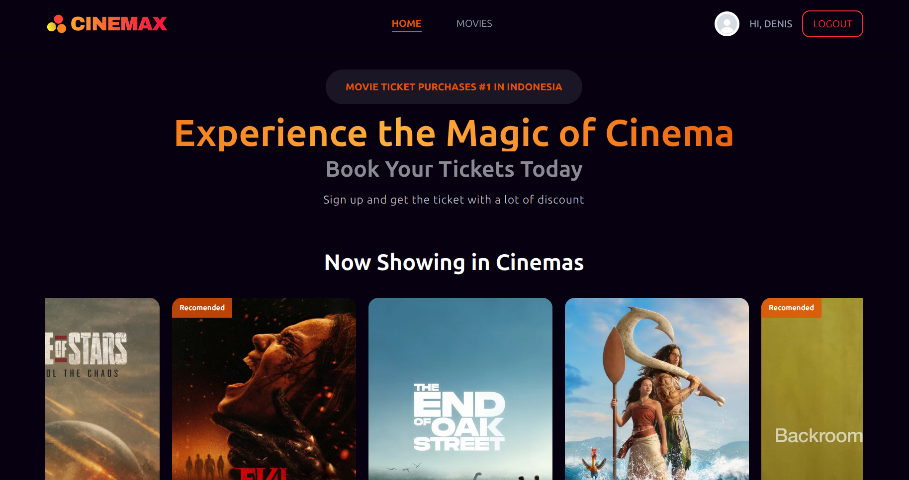
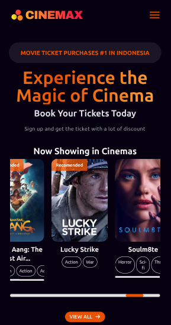

# Cinemax

A modern and responsive online cinema ticketing application prototype built with React and TypeScript. Browse movies from TMDB, book seats, pay, and manage your profile — complete with an admin dashboard.

## Preview

<div align="center">
  
  
</div>

## 🚀 Features

- 🎬 Movie catalog sourced from the **TMDB API**
  - Now Playing & Upcoming sections
  - Search, genre filter, and pagination on the explore page
  - Detailed movie page (cast, directors, runtime, genres)
- 🔐 Authentication flow: login, register, forgot & reset password
- 🎫 Booking flow: pick a movie → choose seats → payment method → e-ticket
- 👤 Profile: account information and booking history
- 🛠️ Admin dashboard (with charts), add movie, and movie list management
- 🧪 Mock adapter for full dev experience without a backend (`VITE_ENABLE_MOCKS=true`)
- 💾 State persisted across sessions with Redux Persist
- 📱 Fully responsive, mobile-friendly UI

## 🛠️ Tech Stack

- **Frontend Framework**: React 19 with TypeScript
- **Build Tool**: Vite 6
- **Styling**: Tailwind CSS v4
- **State Management**: Redux Toolkit with Redux Persist
- **Server State**: TanStack Query (React Query)
- **Routing**: React Router DOM v7
- **Form Handling**: React Hook Form + Yup validation
- **HTTP Client**: Axios
- **Data Fetching**: TMDB API + custom backend contract
- **Charts**: Chart.js with react-chartjs-2
- **Icons**: React Icons
- **Containerization**: Docker (multi-stage build)

## 📋 Prerequisites

- Node.js 18 or higher
- pnpm (recommended) or npm
- Docker (optional, for containerized deployment)
- TMDB API key (see [Configuration](#-configuration))

## 🚀 Getting Started

### Environment Setup

Copy `.env.example` to `.env.local` and fill in the values:

```bash
cp .env.example .env.local
```

### Local Development

1. **Install dependencies**
   ```bash
   pnpm install
   # or
   npm install
   ```

2. **Start the development server**
   ```bash
   pnpm dev
   # or
   npm run dev
   ```

3. **Open your browser**
   Navigate to `http://localhost:5173` to view the application.

### Docker Deployment

1. **Build the Docker image**
   ```bash
   docker build -t image-cinemax .
   ```

2. **Run the container**
   ```bash
   docker-compose up -d
   ```

3. **Access the application**
   Open your browser and go to `http://localhost:9802`.

## 📁 Project Structure

```
cinemax/
├── public/
│   └── [static assets]
├── src/
│   ├── app/
│   │   ├── App.tsx                 # Route definitions
│   │   ├── ErrorBoundary.tsx
│   │   └── providers.tsx           # Global providers (store, query, router)
│   ├── features/
│   │   ├── admin/                  # Admin dashboard, add & list movies
│   │   ├── auth/                   # Login, register, forgot/reset password
│   │   ├── movies/                 # Home, explore, and movie detail pages
│   │   ├── order/                  # Seat, payment, and ticket booking flow
│   │   └── profile/                # Account information and booking history
│   ├── shared/
│   │   ├── components/             # Reusable UI components & layouts
│   │   ├── config/env.ts           # Environment variable access
│   │   ├── hooks/                  # Typed Redux hooks & debounce
│   │   ├── lib/                    # HTTP clients, query client, TMDB client
│   │   ├── mocks/                  # Dev-only mock adapter & in-memory DB
│   │   └── types/                  # Shared TypeScript types
│   ├── store/                      # Redux store & persisted reducers
│   ├── index.css
│   └── main.tsx
├── docs/
│   ├── backend-contract.md         # Custom backend API contract
│   └── refactor-plan.md
├── .env.example
├── Dockerfile
├── docker-compose.yml
├── eslint.config.js
├── package.json
├── tsconfig.json
├── vite.config.ts
└── README.md
```

## 🔧 Configuration

Configuration is done through environment variables (see `.env.example`):

| Variable               | Description                                      | Default                         |
| ---------------------- | ------------------------------------------------ | ------------------------------- |
| `VITE_TMDB_URL`        | TMDB API base URL                                | `https://api.themoviedb.org/3`  |
| `VITE_TMDB_API_KEY`    | TMDB API key                                     | —                               |
| `VITE_TMDB_IMAGE_URL`  | TMDB image base URL                              | `https://image.tmdb.org/t/p/w500` |
| `VITE_API_URL`         | Custom backend URL (auth/order/profile/admin)    | `http://localhost:8800`         |
| `VITE_API_IMAGE_URL`   | Custom backend image uploads URL                 | `http://localhost:8800/uploads` |
| `VITE_ENABLE_MOCKS`    | Use the dev-only mock adapter instead of backend | `true`                          |

### Data Source

- **Movie catalog** comes from the public **TMDB API** (`src/features/movies/api/tmdb.ts`).
- **Auth, orders, payments, profile, and admin** target the custom backend (`VITE_API_URL`), whose contract is documented in [`docs/backend-contract.md`](docs/backend-contract.md). Until the backend exists, run with `VITE_ENABLE_MOCKS=true` to use the mock adapter (`src/shared/mocks`).

## 📱 Features Overview

### Authentication
- Login, register, forgot password, and reset password pages
- Protected routes redirect unauthenticated users
- Token injected via Axios interceptor and persisted in Redux

### Movie Catalog (TMDB)
- Now Playing and Upcoming movie rows on the home page
- Explore page with live search, genre filter, and pagination
- Detailed movie page with synopsis, cast, and director info

### Booking Flow
- Seat selection with a timeline indicator
- Payment page with multiple payment methods (OVO, GoPay, DANA, Visa, etc.)
- E-ticket page with QR code and booking details

### Profile
- View and edit account information
- Booking history with transaction status (success / pending / failed)

### Admin
- Dashboard with chart.js visualizations
- Add and manage movies (list, delete)

### Data Persistence
- Session state (auth, booking, order) automatically saved to localStorage using Redux Persist
- Data persists across browser sessions and page refreshes

### Responsive Design
- Fully responsive layout that works on desktop, tablet, and mobile devices

## 🤝 Contributing

1. Fork the repository
2. Create your feature branch (`git checkout -b feature/AmazingFeature`)
3. Commit your changes (`git commit -m 'Add some AmazingFeature'`)
4. Push to the branch (`git push origin feature/AmazingFeature`)
5. Open a Pull Request

## 📄 License

This project is licensed under the MIT License - see the [LICENSE](LICENSE) file for details.

## 🙏 Acknowledgments

- TMDB for the movie data API
- React team for the amazing framework
- Vite team for the fast build tool
- Tailwind CSS for the utility-first CSS framework
